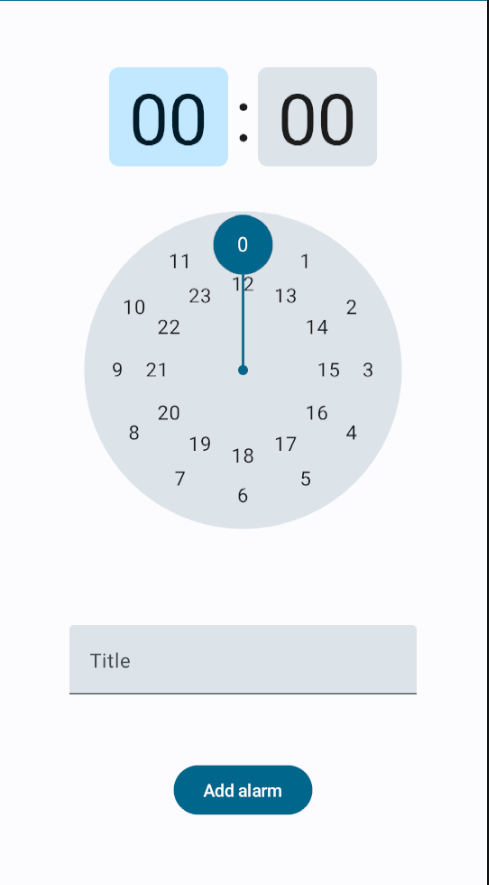

# Alarm Clock Android App

|  Main Screen  |         Upsert Screen         |
|:-------------:|:-----------------------------:|
|  |  |

## Features

- list of alarms
- turn on/off alarm (switch)
- add or update alarm
- notifications

## Tech Stack and Architecture

- Kotlin
- MVVM (ViewModel as a State Holder), UDF, Google Architecture Guidelines
- Room Database
- Kotlin Coroutines
- Coroutines Flow, StateFlow
- Jetpack Compose
- Compose Navigation
- Dagger-Hilt
- AlarmManager, BroadcastReceiver, Notifications

## Contacts

- mark130599@gmail.com
- Telegram: @mark_gardie
- [Linkedin](https://www.linkedin.com/in/mark-gardie/)
